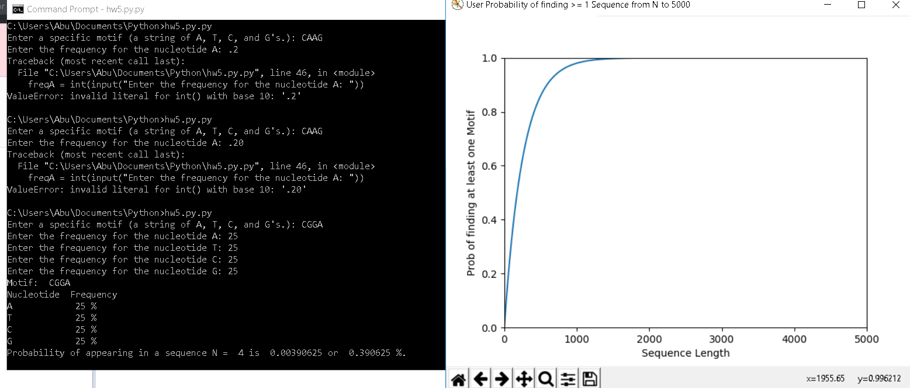

# MotifCalculator

Program determines a motifs expected frequency.

User inputs a specific motif - a sting of A, T, C, G's (program checks if string is valid).
Next, it asks the user to enter the frequency at which each nucleotide exists in their hypothetical genome.

Then calculates Probability of appearing in a sequence size N, and plots the probability of finding at least one of these motifs in a sequences of length N to 10,000.

Example output below:

